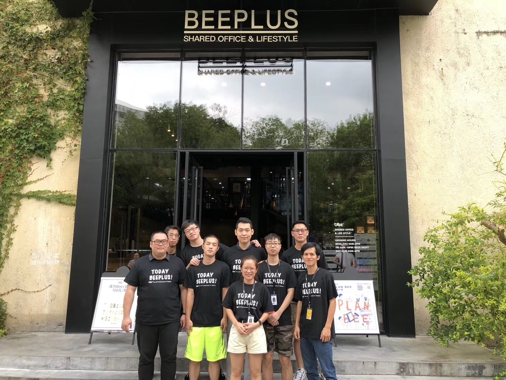
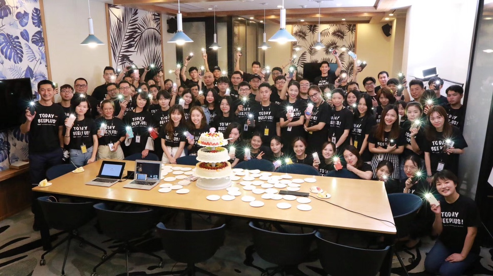

## 0x00 起点
2021年4月26日，深圳小雨。现在我在深圳返回武汉的列车上，准备离开这里。
三年前，我带着两万块钱裸辞来到这片土地，对未来充满期待。

这三年里我完成了职业生涯的转型，碰到了很多人，学到了很多东西，也加过了很多班。
我觉得即便是多年以后，我也会想起，晚上的科技园依然是灯火通明，深大站9点依然是被刚下班的人群挤满，租住的房间依然是狭小而局促。
这里是最好的城市，因为无数打工人的夜以继日，孕育出了富可敌国的宇宙中心南山区。
这里也是最坏的城市，高企的房价、糟糕的医疗教育让年轻人无法驻足。
但是没有人会否认，这是一项伟大的社会实验。仅仅40年就把一个小渔村变成了一座国际都市。
这里是中国最年轻的城市，他们来自天南海北，说着各地口音的普通话在这里交流碰撞。当然，你也可以听到各地方言，甚至还有广东话。文化上的脱粤让这里变成了中国城市中的异类，每个人都能在这里找到一份属于自己的熟悉感。湖南的炒菜，海南的椰子鸡，四川的火锅，各种口味的餐馆都能在这里生存下来。
也许我还会怀念广东的天气，超长的夏日，偶尔微凉的小雨下个半小时，有时还能跟太阳一起出现。偶尔的一波台风也会将这里淹成泽国。
<!--more-->

这是中国深圳，是中国改革开放的缩影。

## 0x01 深圳往事
BEEPLUS是我加入过的一家很酷的公司。公司整个领导层都是90后，学生时代团队创业，现在已经在国内共享办公行业大有作为。创始人贾凡将公司对标wework，想做共享办公行业的苹果，强调设计驱动。公司也聘请了很多很优秀的建筑设计师，做了很多很棒的空间产品。
**奶茶店**

**午休仓**

**超级烘焙工坊**

**G&G管理总部**

工作环境有可升降桌椅，免费的饮料与咖啡吧台等等。
面试我的IT经理叫kaycee，是个马来西亚华人，也是snapchat的员工，当时在B+是兼职。技术团队规模很小，只有不到10个人。

后来经过几年发展，公司规模达到了几百号人，朝气蓬勃。

我也认识了很多有趣的同事，例如自走棋达人谷朝阳，热爱生活的潘青，为人和善的东北刀斯林老哥陈作为，家里五套房还跟我们一起996的深圳本地土豪萝卜等等。

不过出于个人职业发展的原因，我还是选择了离职，毕竟行业受限，技术积累比较薄弱，而且IT也不是主营业务。

----------------------------

金证股份是一家在A股上市的金融公司，因为一些机缘巧合，我加入了他们的子公司丽海虹金。子公司主要负责做量化交易系统，有各种C++大佬。我主要负责做交易软件的客户端(electron + angular)，然后提供给母公司/公募/私募基金的交易员去使用。

这家公司非常棒的一点是节假日放假不用进行难以忍受的补班，因为不开市，所以加上年假春节可以愉快的连休14天。也是从这里，我学到了很多金融相关知识。工作中碰到的业务逻辑有时异常复杂，例如需要进行各种金融专业概念的计算，算很多实时的盈亏，算保证金等等。到末期，我也有参与开发一个清算系统。与此同时，我也理所当然的踏入了股市的大坑，变成了美股港股A股三市韭菜，截止到目前战绩总体持平。

这也是我在深圳呆的最久的一家公司。在职期间，发小周锐也来到了深圳。

我们住的地方是一家专做出租的青年公寓，叫做集悦城，在大学城地铁站附近。当时也经历了一波互联网房地产公司暴雷潮，很多公寓例如蛋壳等纷纷违约，在丽海虹金有同事住的蛋壳，直接被房东赶出公寓，房租也是血本无归。万幸我们这个公寓还在正常运营，没有踩到这波大坑。

