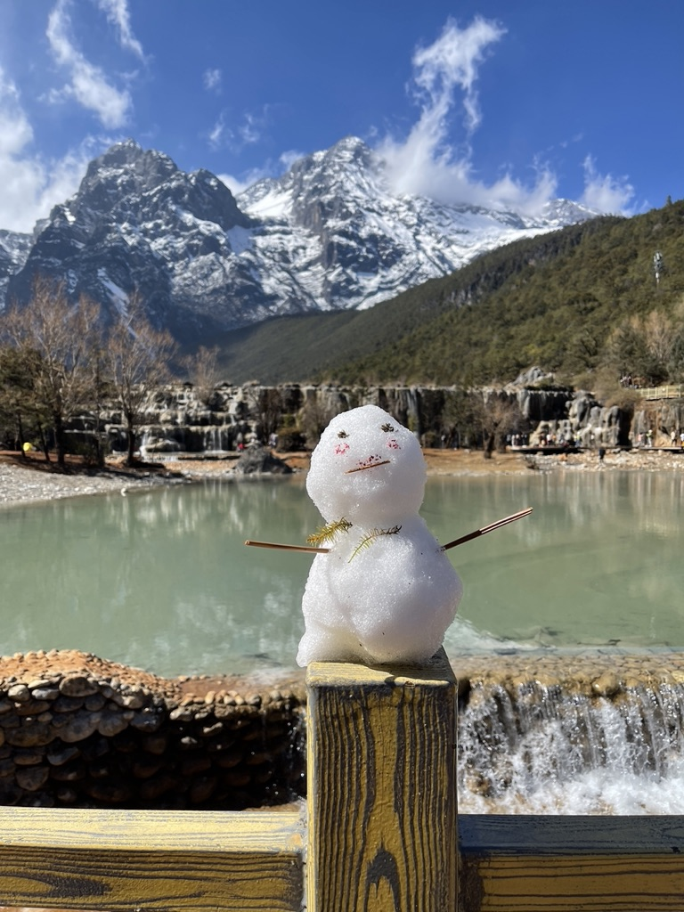
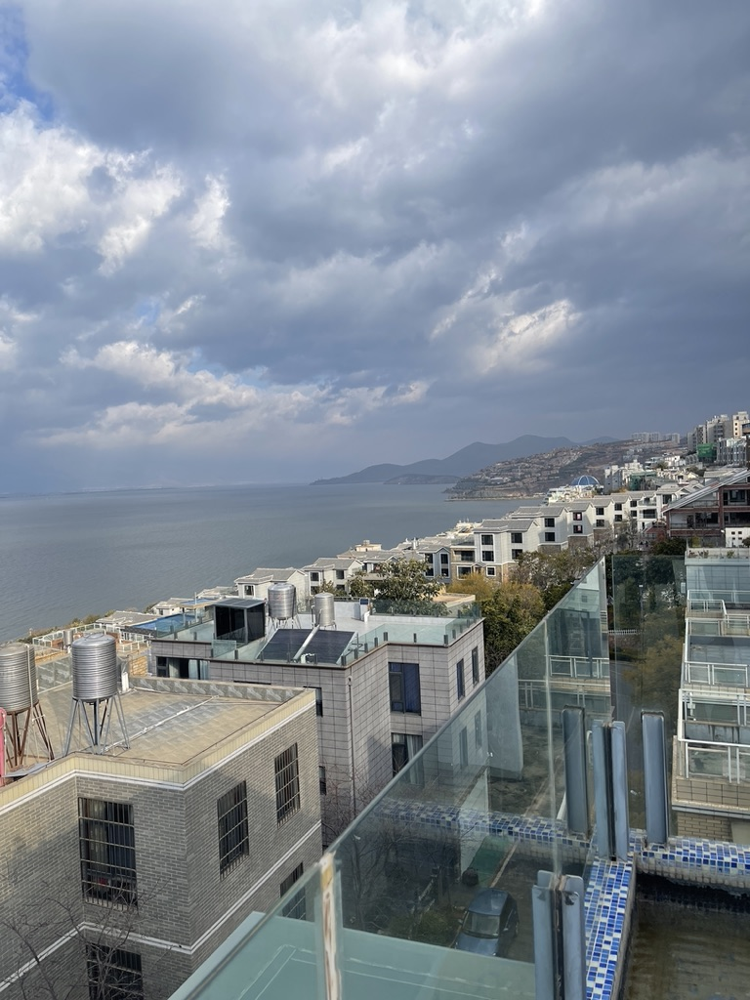
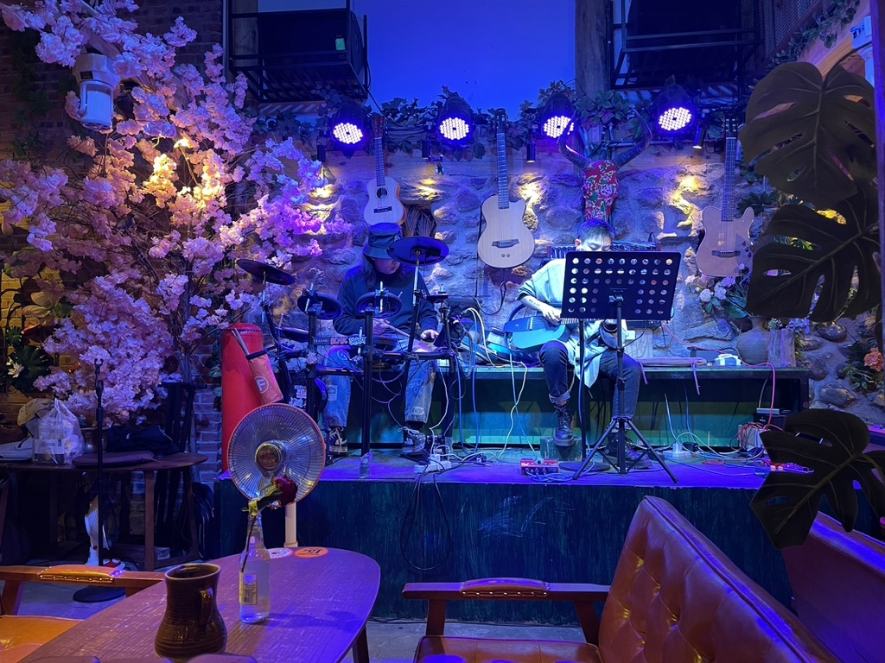
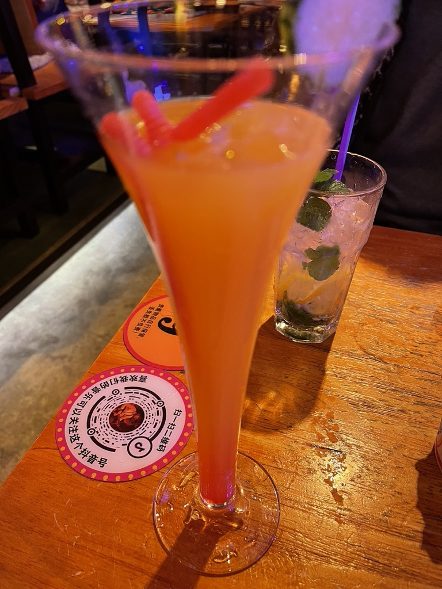
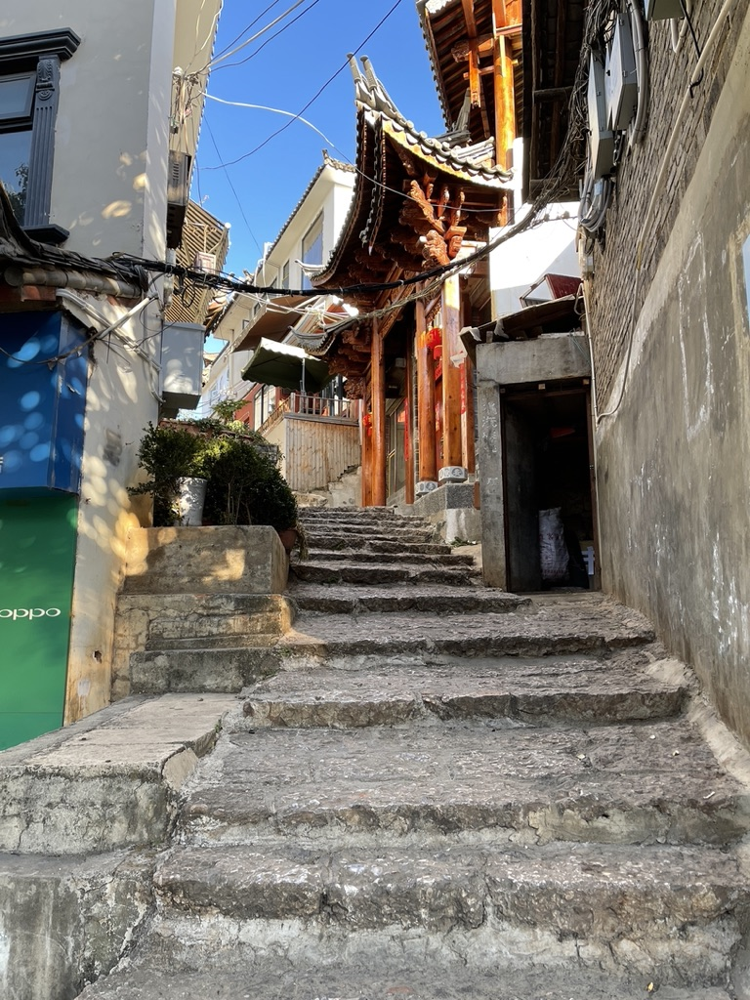
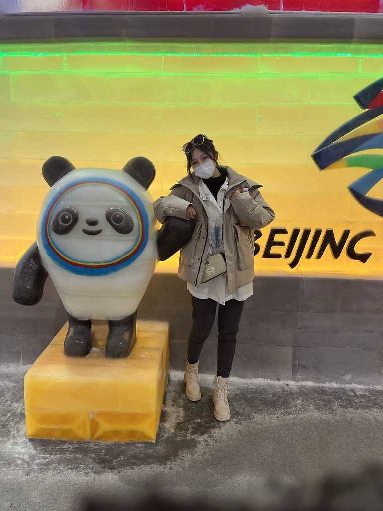

我已经不记得是哪天第一次见到你了。应该是我毕业不久，可能是那天阳光正好，你穿了一件我喜欢的衣服，从此我的世界里便经常出现你的影子，偶尔是在眼前，偶尔是在梦里。
我生性不善言辞，话语较少，对情绪不太敏感，你第一次答应我时，我有满心的喜悦，却不知如何表达出来。我真的不知如何去做，我也没有去想应该用什么样的姿态去面对你，就这样一切如常，直到你第一次彻底爆发。我当时措手不及，根本不知道去怎么应对，然而你还是原谅了我，我以为当时是我做对了什么。现在想来只是你还在照顾我的情绪罢了。
我们的感情熬过了寒冷的冬季，却没有挺过这个温暖的春天。
<!--more-->
我以前一直想看看外面的世界，我觉得世界很大，人很渺小。我想去北京上海深圳，挣好多好多的钱，我就可以做我想做的事情，我经常在想，如果我财富自由了，我就会带着我女朋友去环游地球，从江南走到西藏，从贝加尔湖走到欧洲，看看祖国的大好河山，看看人类文明的波澜壮阔。人生百年相比宇宙如沧海一粟，我想在有生之年带你探索这个星球，吃遍全世界的美味。
因此我很期待这次旅行，我以为雪山只是开始，没有想到却是结局。我不是那种规划性很强的人，比较随性，出去玩也是这样，想睡懒觉就睡个懒觉，想改变行程就随时调整，但是我真的没有注意到你的情绪变化。我们登到雪山山顶，4570，那里真的很美，也很冷，但是我第一次感觉到内心无比的火热。

雪山很美，但不及你万分之一。

我们又去了文青最爱的大理。去了苍山洱海，去了大理古城，找到了一家好听的酒吧，听她静静地唱着那些熟悉的民谣。我记得酒很烈，歌很好听，夜晚很美，我们红着脸搀扶着彼此一起慢慢的往回走。我想这样走一辈子，我也以为可以这样。我从没想到故事到这里就戛然而止。

我在你最需要我的时候没有出现，而你仿佛也发现了你其实并不需要我。
现在这些事情好像突然对我失去了意义，更好的工作、长途的旅程，突然就没有了任何的吸引力。我突然意识到你才是我的全世界里最重要的事情。

如果可以，我想回到3个月前，我一定天天围着你转。我想你。